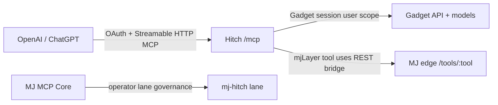

# Hitch Agent MCP Handoff

Date: 2026-05-15  
Lane: `mj-hitch`  
Local app: `/Volumes/Stratos_Tools/projects/hitch2`  
GitHub repo: `Sentinel-Stratos-Strategies/hitch2`  
Public app: `https://hitch.ellis-aegis.us`  
Hitch MCP endpoint: `https://hitch.ellis-aegis.us/mcp`

## Current State

The local Hitch project is a Gadget app with React Router frontend, OpenAI/ChatGPT MCP integration, Stripe subscription actions, Stream Chat hooks, and an MJ bridge tool.

Review evidence from this pass:

- Local branch: `main`
- GitHub remote: `https://github.com/Sentinel-Stratos-Strategies/hitch2.git`
- GitHub visibility: private
- Local git status at review: clean
- `ggt whoami`: logged in as Joe Ellis
- `ggt status`: files are up to date
- `yarn build`: passed
- `ggt problems`: production is missing variables from the current environment
- `GET https://hitch.ellis-aegis.us/mcp`: `200`
- OpenAPI and OAuth metadata endpoints on `hitch.ellis-aegis.us`: `200`
- OpenAI apps challenge endpoint: `200`
- OpenAI subdomain verification endpoint: `200`, but still returned `openai-subdomain-verification=REPLACE_WITH_YOUR_TOKEN`

DNS/domain work is intentionally left to the Cloudflare agent.

## Lane Files

The Hitch mini-lane is recorded here:

```text
projects/mj-mcp/lanes/hitch/lane.manifest.json
projects/mj-mcp/lanes/hitch/mcp-connection.v1.json
projects/mj-mcp-layer/docs/handoffs/hitch-agent-mcp-handoff.md
```

## Connection Architecture



There are two different surfaces:

- OpenAI/ChatGPT connects to Hitch through `https://hitch.ellis-aegis.us/mcp`.
- Hitch's `mjLayer` tool currently calls `${MJ_EDGE_URL}/tools/:tool`.

Do not point Hitch's current `mjLayer` implementation directly at `/mcp` unless the code is changed to speak the MCP transport. For now, either set `MJ_EDGE_URL` to an MJ host that exposes `POST /tools/:tool`, or add a compatibility adapter.

## Hitch Agent Setup

1. Pull the latest app:

```bash
cd /Volumes/Stratos_Tools/projects/hitch2
git pull --ff-only
ggt whoami
ggt status
```

2. Verify public domain and MCP metadata:

```bash
curl -sS https://hitch.ellis-aegis.us/mcp
curl -sS https://hitch.ellis-aegis.us/.gadget/chatgpt/openapi.json
curl -sS https://hitch.ellis-aegis.us/.well-known/oauth-protected-resource
curl -sS https://hitch.ellis-aegis.us/.well-known/openid-configuration
curl -sS https://hitch.ellis-aegis.us/.well-known/oauth-authorization-server
curl -sS https://hitch.ellis-aegis.us/.well-known/openai-apps-challenge
curl -sS https://hitch.ellis-aegis.us/.well-known/openai-subdomain-verification.txt
```

3. Set or verify Gadget production variables.

Production was read-only for most `ggt var` operations in this CLI, so use the Gadget dashboard if needed.

Required for OpenAI/MCP:

```text
PUBLIC_APP_URL=https://hitch.ellis-aegis.us
CUSTOM_DOMAIN_URL=https://hitch.ellis-aegis.us
OPENAI_SUBDOMAIN_VERIFICATION_TOKEN=<OpenAI Builder Profile token>
OPENAI_APPS_CHALLENGE_TOKEN=<OpenAI Apps challenge token if overriding code default>
OPENAI_API_KEY=<OpenAI key used by Hitch tools>
MCP_SAMPLING_TIMEOUT_MS=3500
```

Required for Hitch to call the MJ edge bridge:

```text
MJ_EDGE_URL=<MJ edge host that supports POST /tools/:tool>
MJ_EDGE_OPERATOR_TOKEN=<lane-issued operator token>
MJ_EDGE_OPERATOR_HEADER=x-ellis-aegis-token
```

Required if billing is active:

```text
STRIPE_SECRET_KEY=<Stripe secret key>
STRIPE_WEBHOOK_SECRET=<Stripe webhook signing secret>
STRIPE_PRICE_ID_MONTHLY=<monthly price id>
STRIPE_PRICE_ID_YEARLY=<yearly price id>
```

Required if Stream Chat is active:

```text
STREAM_API_KEY=<Stream API key>
STREAM_API_SECRET=<Stream API secret>
```

4. Configure OpenAI/ChatGPT MCP.

Use these settings:

```text
MCP endpoint: https://hitch.ellis-aegis.us/mcp
OpenAPI import: https://hitch.ellis-aegis.us/.gadget/chatgpt/openapi.json
Auth: OAuth 2.1 authorization code with PKCE
Authorization URL: https://hitch.ellis-aegis.us/api/oauth/v2/auth
Token URL: https://hitch.ellis-aegis.us/api/oauth/v2/token
Dynamic registration URL: https://hitch.ellis-aegis.us/api/oauth/v2/reg
Primary scope: user
Optional scopes: openid offline_access
```

5. Run smoke checks.

```bash
cd /Volumes/Stratos_Tools/projects/hitch2
yarn build
ggt problems
HITCH_MCP_URL=https://hitch.ellis-aegis.us/mcp node ./scripts/mcp-smoke.mjs
```

Use the full MCP smoke only after the OpenAI key and Gadget variables are correct because it calls live MCP tools.

## Current MCP Tool Inventory

The local smoke harness expects these Hitch tools:

```text
askHitch
askHarbor
askHarry
saveAdvice
listSavedAdvice
saveConversation
listConversations
createJournalEntry
listJournalEntries
createMilestone
listMilestones
browseDateIdeas
listResources
createDateFeedback
getMyProfile
createSuccessStory
listSuccessStories
__getGadgetAuthTokenV1
mjLayer
```

## Boundaries

The Hitch lane can:

- Read GitHub repo status and PR state.
- Read Gadget sync/problemlist/env key names.
- Verify public MCP and OAuth metadata.
- Prepare OpenAI submission evidence.
- Read redacted logs and deployment metadata.
- Plan Gadget, OpenAI, Cloudflare, Stripe, Stream, and MJ bridge changes.

The Hitch lane cannot:

- Read or print secret values.
- Dump production user data.
- Deploy Gadget production without explicit approval.
- Change DNS while the Cloudflare agent owns the DNS task.
- Submit OpenAI review while verification endpoints are not green.
- Use a user OAuth token to call MCP tools without explicit user/session auth.

## Handoff To Hitch Agent

Your next job is to finish the live MCP connection, not to redesign the app.

Priority order:

1. Wait for Cloudflare agent to finish DNS/domain routing.
2. Confirm `https://hitch.ellis-aegis.us/mcp` and all OAuth metadata still return `200`.
3. Replace `OPENAI_SUBDOMAIN_VERIFICATION_TOKEN` in Gadget production so the verification endpoint no longer returns `REPLACE_WITH_YOUR_TOKEN`.
4. Resolve `ggt problems` by aligning production variables.
5. Confirm whether the MJ edge host exposes `POST /tools/:tool`. If not, create a small compatibility adapter or update Hitch `mjLayer` to speak MJ MCP.
6. Run `node ./scripts/mcp-smoke.mjs` against `https://hitch.ellis-aegis.us/mcp`.
7. Only then proceed to OpenAI Builder/Profile/App review submission.
